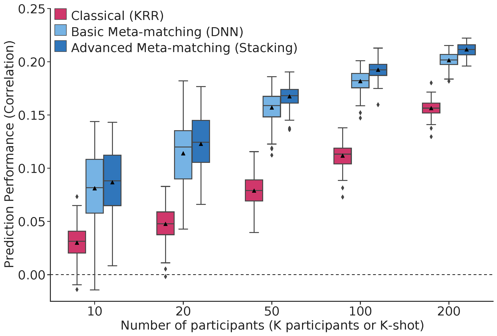

## Reference

+ He, T., An, L., Chen, P., Chen, J., Feng, J., Bzdok, D., Holmes, A.J., Eickhoff, S.B. and Yeo, B.T., 2022. [**Meta-matching as a simple framework to translate phenotypic predictive models from big to small data**](https://doi.org/10.1038/s41593-022-01059-9), Nature Neuroscience 25, 795-804.

----
## Background

There is significant interest in using brain imaging to predict phenotypes, such as cognitive performance or clinical outcomes. However, most prediction studies are underpowered. We propose a simple framework – meta-matching – to translate predictive models from large-scale datasets to new unseen non-brain-imaging phenotypes in small-scale studies. The key consideration is that a unique phenotype from a boutique study likely correlates with (but is not the same as) related phenotypes in some large-scale dataset. Meta-matching exploits these correlations to boost prediction in the boutique study. We apply meta-matching to predict non-brain-imaging phenotypes from resting-state functional connectivity. Using the UK Biobank (N=36,848) and HCP (N=1,019) datasets, we demonstrate that meta-matching can greatly boost the prediction of new phenotypes in small independent datasets in many scenarios. For example, translating a UK Biobank model to 100 HCP participants yields an 8-fold improvement in variance explained with an average absolute gain of 4.0% (min=-0.2%, max=16.0%) across 35 phenotypes.



----
## Code Release
This release contains the code to train your own meta-matching model from scratch. If you need pre-trained Meta-matching model (used in our experiment 2 with result shown in above figure), please visit our [Meta_matching_models repo](https://github.com/ThomasYeoLab/Meta_matching_models).

### Download stand-alone repository
Since the whole Github repository is too big, we provide a stand-alone version of only this project and its dependencies. To download this stand-alone repository, visit this link: [https://github.com/ThomasYeoLab/Standalone_He2022_MM](https://github.com/ThomasYeoLab/Standalone_He2022_MM)

### Download whole repository
If you want to use the code from our lab's other stable projects (other than He2022_MM), you would need to download the whole CBIG repository.

- To download the version of the code that was last tested, you can either

    - visit this link:
    [https://github.com/ThomasYeoLab/CBIG/releases/tag/v0.29.6-He2022_Ooi2022-updates](https://github.com/ThomasYeoLab/CBIG/releases/tag/v0.29.6-He2022_Ooi2022-updates)

    or

    - run the following command, if you have Git installed
 
    ```
    git checkout -b He2022_Ooi2022-updates v0.29.6-He2022_Ooi2022-updates
    ```
----

## Usage
### Environment setup
- Our code uses MATLAB and Python, here are info about MATLAB and Python setup:
    - MATLAB: we tested our code in MATLAB r2018b
    - Python
        1. Install [Miniconda](https://docs.conda.io/en/latest/miniconda.html) or [Anaconda](https://www.anaconda.com/distribution/#download-section) with Python 3.x if you don't have conda
        2. Create conda environment from our `replication/config/CBIG_MM_python_env.yml` file by `conda env create -f replication/config/CBIG_MM_python_env.yml`

### Example
- The example of our code is detailed in `examples/README.md`

### Replication
- If you have access to HCP and UK Biobank dataset, you can replicate our result using the instructions detailed in `replication/README.md`.

----

## Updates
- Release v0.29.6 (16/1/2024): Update subcortical ordering to be consistent with CBIG pipeline.
- Release v0.22.2 (16/03/2022): Update examples and unit test
- Release v0.22.0 (24/02/2022): Initial release of He2022_MM project

----

## Bugs and Questions

Please contact Tong He at hetong1115@gmail.com, Lijun An at anlijun.cn@gmail.com, Pansheng Chen at chenpansheng@gmail.com and Thomas Yeo at yeoyeo02@gmail.com.

